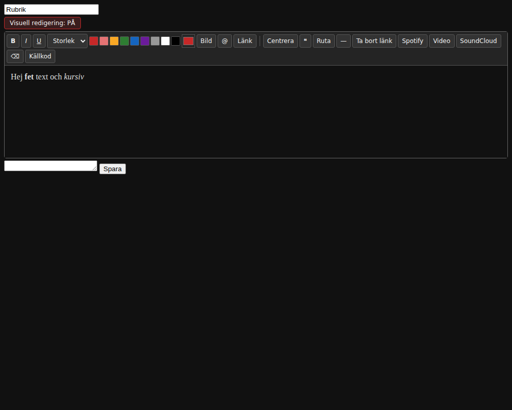
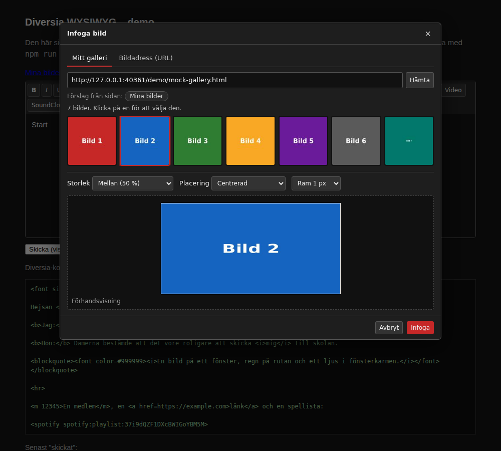
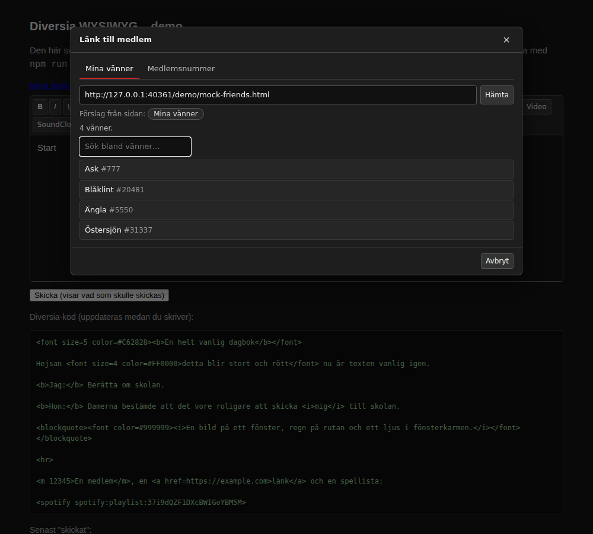
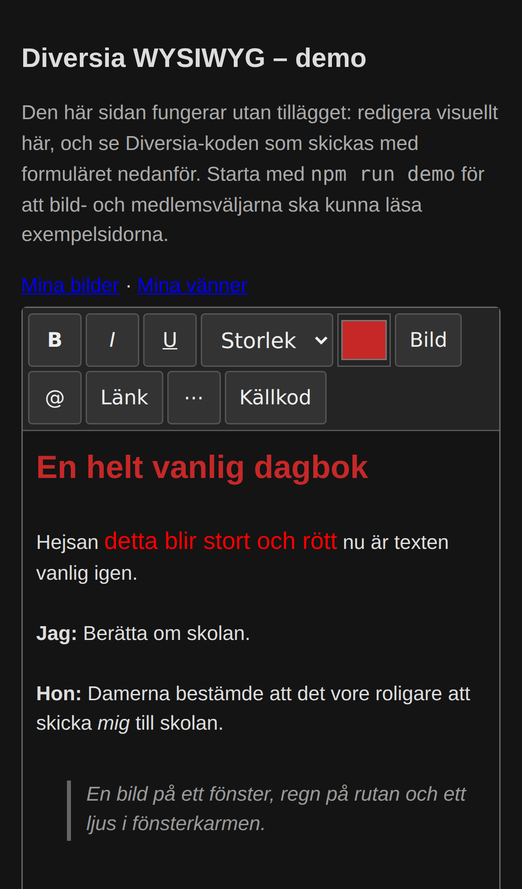

# Diversia WYSIWYG

> **På svenska:** [README.md](README.md) är huvuddokumentationen. Den här filen är en engelsk översättning.

A browser extension for **Chrome, Firefox and Safari** (Mac, iPhone and iPad) that adds **visual (WYSIWYG) editing** to [Diversia](https://diversia.social/). You can format journal entries, presentations and forum posts with buttons instead of writing `<font size=4 color=#C62828>` by hand.

*Diversia was formerly Darkside.se.*



## What it does

- Adds a **"Visual editing: ON/OFF"** switch above every larger text box on Diversia.
- Shows the text **as it will look**, with the site's own font and colours, and a toolbar for:
  - **Text:** **B** *I* <u>U</u>, text size 1–6, colours (a palette plus a free colour picker).
  - **Layout:** centre, quote (`<blockquote>`), box (`<box>`), divider line (`<hr>`).
  - **Links and media:** links, images from your gallery or any address, and member links from your friends list (see below).
  - **Embeds:** Spotify (paste an `open.spotify.com` link and it's converted to the URI Diversia needs), YouTube/Vimeo and SoundCloud.
  - **Clean-up:** clear formatting, and a **Source** mode for editing the raw markup directly.
- **Keeps the original text box** and updates it as you type. The page's own form, drafts and "Save" button work exactly as before. The extension never submits anything itself.
- **Cleans up pasted text.** Content from Word, Google Docs or web pages is reduced to what Diversia supports: headings become large bold text, lists become lines, and scripts and styles are removed. Pasted Diversia markup is recognised and shown formatted.
- **Leaves your markup alone.** Opening and closing the editor doesn't change a single character of your existing text. Mis-nested tags such as `<b><i>x</b></i>` are repaired into correct last-in-first-out order, and unknown tags stay visible exactly as the site shows them.
- **Remembers your choice.** If you leave visual editing on, it opens that way next time.

It runs automatically on `diversia.social` and `diversia.se`. On any other page, click the toolbar icon to add the editor to that tab only.

The interface is in Swedish when the page is Swedish, and in English otherwise.

## Image picker



Click **Bild** to open the image picker. It has two tabs:

- **My gallery** reads your gallery page on the site and shows your **albums** first, each with its cover and name. Click an album to see the pictures in it, and **← All albums** to come back.
  - **It stays inside your gallery.** The site's shortcuts to everyone's pictures ("100.000-tals bilder", "Persongalleriet") look exactly like album links but are never followed, and neither are the profile, guestbook, diary or friends list, which sit in the same folder and carry the same member number.
  - **Only what you click is fetched.** Opening the picker reads one page: your gallery's front page, which already carries each album's name and cover. Opening an album reads one more. Nothing is fetched ahead of time and nothing recurses — the site has anti-scraping measures, and only a click causes a request.
  - Pictures sitting loose on the gallery page, outside any album, are shown below the albums.
  - Thumbnails drawn as a background image, which is what Diversia does, are read just as well as plain ``.
  - **It shows pictures only.** The site's furniture is filtered out: smileys and reaction emojis, the star and the black square laid over the pictures, the placeholder for a withheld image, banners, icons — and the avatars of whoever commented, which otherwise land among your own pictures. It uses the full-size image when a thumbnail links to one.
  - **The address usually finds itself.** The site's own menu links to your gallery, and a personal page carries your member number where the site-wide one doesn't (`/pic/?id=250` against `/pic/`). That link is chosen straight away, so the gallery is already loaded when the picker opens.
  - If no such link exists, paste the address the first time, or click one of the suggestions from the menu. Only your own pages are suggested, never the site's shortcuts to everyone's pictures. Once the gallery has loaded the address row disappears; **Change gallery address** brings it back.
- **Image address (URL)** takes any image link and checks it first:
  - rejects files on your own computer (`data:`, `blob:`, `file:`) and things that aren't web addresses
  - switches `http://` to `https://`, since the site requires it
  - fixes common "page instead of image" links (imgur pages, Dropbox `?dl=0`) and warns about Google Drive/Photos
  - actually loads the image, so it can tell you whether the address is really a picture and how big it is, with a hint when it's a web page instead
  - suggests a smaller size for very wide images

  If the check fails but you know the address is right, for example a site that blocks previews, you can still choose **Insert anyway**.

Both tabs share simple settings for **size** (original, 25/50/75/100 %, or a width in pixels), **position** (none, left or right with text wrapping, centred) and **border**, with a live preview.

**Click an image** in the editor to change these settings later or remove the image.

## Member picker



Click **@** to open the member picker.

- **Friends:** it reads your friends list page, with the same automatic detection and address-or-suggestion setup as the gallery, and shows a searchable list, sorted the Swedish way (Å Ä Ö last). Type part of a name and press Enter to insert it.
- **Number:** the other tab takes a member number directly.
- **Selected text:** if you had text selected, that text becomes the link. Otherwise the member's name is used.

Both pickers read pages only from the site you're on, as the logged-in you, and never contact anything else.

> **Check once:** the member picker reads the number from profile links (`…?id=12345`, `/medlem/12345`…). On most sites that's the same number as the member number shown on the presentation page, but verify it with one friend the first time.

## Install

`npm run build` creates one package per browser in `dist/`:

| Package | For |
|---|---|
| `diversia-wysiwyg-chrome-<v>.zip` | Chrome, Edge, Brave, Opera, Vivaldi |
| `diversia-wysiwyg-firefox-<v>.zip` | Firefox on desktop and Android |
| `diversia-wysiwyg-safari-<v>.zip` | Safari on macOS, iOS and iPadOS |

The unpacked folders are next to them in `dist/chrome`, `dist/firefox` and `dist/safari`. The repository root is also a valid Chrome extension.

### Chrome (and Edge, Brave…)

**Try it now:**

1. Open `chrome://extensions` and switch on **Developer mode**.
2. Click **Load unpacked** and pick `dist/chrome`.

It stays installed.

**Publish:** upload the zip to the Chrome Web Store, which has a one-time developer fee. Edge Add-ons is free.

### Firefox

**Try it now:**

1. Open `about:debugging#/runtime/this-firefox`.
2. Click **Load Temporary Add-on…** and pick `dist/firefox/manifest.json`.

It stays until Firefox restarts.

**Keep it:** submit the zip to [addons.mozilla.org](https://addons.mozilla.org/developers/). It's free. Choose *On your own* for a signed file only you share, or list it publicly.

**Permissions:** Firefox lets users decide on site access. If the switch doesn't appear on Diversia, click the Extensions (puzzle piece) button and allow the extension on that site.

### Safari (Mac)

**Try it now (Safari 26 or later):**

1. Go to Safari → Settings → **Developer**. If you don't see it, first switch on *Show features for web developers* under Advanced.
2. Click **Add Temporary Extension…** and pick the `dist/safari` folder.

It's unloaded when Safari quits, so add it again after a restart.

**Keep it, and get it on iPhone/iPad:** Safari extensions are distributed through the App Store and require the Apple Developer Program, which has a yearly fee. There are two ways:

- **Upload** the Safari zip through **App Store Connect**, which packages web extensions without a Mac or Xcode. It covers macOS, iOS and iPadOS.
- **Or, on a Mac with Xcode,** run `xcrun safari-web-extension-converter dist/safari` and build the generated app.

**Permissions:** Safari asks you to allow the extension per website. Choose *Always allow on this website* for Diversia.

### On a phone or tablet

The editor adapts when it's narrow:

- The most-used tools (**B I U**, size, colour, **Bild**, **@**, **Länk**, **Källkod**) stay visible, and the rest fold into **⋯**.
- Buttons are finger-sized.
- Dialogs fill the screen.
- Text fields don't trigger the iPhone's auto-zoom.
- Tapping a toolbar button keeps your text selection, even if the tap took the focus away.



## Supported markup

| Diversia | In the editor |
|---|---|
| `<b>` `<i>` `<u>` | Bold, italic, underline |
| `<font size=1-6 color=#RRGGBB lineheight=N>` | Size and colour |
| `<center>`, `<p align=…>` | Centred or aligned block |
| `<blockquote>` | Indented quote |
| `<box align bgcolor padding border bordercolor>` | Box with background and border |
| `<hr size color width>` | Divider line |
| `<br>`, line breaks | Line breaks (Enter inserts a line break, not a new block) |
| `<pre>` | Preformatted text |
| `<a href=https://…>` | Link (https only, as on the site) |
| `` | Image |
| `<m 12345>…</m>`, `<alster 123>…</alster>` | Member and library links (dotted underline) |
| `<video URL>`, `<soundcloud URL>`, `<spotify URI>` | Embed placeholder blocks |
| `&lt;` | A literal `<` |

Tag attributes you didn't touch are kept exactly as written, including their order.

## Version check

The extension asks GitHub once a day what the latest release is. If a newer version exists, a link appears next to the **Visuell redigering** switch: *Version 0.4.0 is available*. Clicking the icon adds the editor, so there is no panel to put the notice in — it goes where you are already looking.

It can be switched off: right-click the icon and choose **Options** (or go via `chrome://extensions`), and clear **Look for new versions**.

This is the extension's only request to anything other than the page you are on. No cookies are sent (`credentials: "omit"`), no headers of our own are set, and nothing about you or your text goes with it. The answer is cached locally for a day, so twenty open Diversia tabs still cost at most one request. No new permission is asked for, since GitHub allows cross-origin reads.

## Privacy

The extension does not collect, send or store any text. What it stores locally in the browser is your on/off preference, whether the version check is enabled, and that check's last answer. The version check above is its only outgoing request. It uses these permissions:

- **`storage`** for those preferences.
- **`activeTab` + `scripting`** so that clicking the icon can add the editor to the tab you're on.
- **Automatic runs** only on the Diversia domains listed above.

Firefox packages also declare that no data is collected (`data_collection_permissions: none`).

## Development

```bash
npm install                      # installs Playwright (tests only)
npx playwright install chromium  # once
npm test                         # converter unit tests + end-to-end tests
npm run screenshots              # refresh docs/*.png
npm run demo                     # demo on http://localhost:8080/demo/index.html
npm run build                    # dist/{chrome,firefox,safari} + zips
```

The layout is small on purpose, with no build step and no dependencies at runtime:

| File | What it does |
|---|---|
| `src/diversia.js` | Parses markup into editor DOM (`parse`) and turns editor or pasted DOM back into markup (`serialize`, whitelist-based) |
| `src/editor.js` | The toolbar and contenteditable editor, bound to a `<textarea>` |
| `src/pickers.js` | The image picker (gallery scan, URL checks, size/position/border) and the member picker (friends list) |
| `src/content.js` | Finds text boxes and adds the switch |
| `src/background.js` | The toolbar icon: injects the editor on any page, and makes the version check's request |
| `src/version.js` | Version-number comparison and the addresses the check uses, shared by the background script and the options page |
| `src/options.html`, `src/options.js` | The options page: the version check's on/off switch and whatever it last found |
| `scripts/build.mjs` | Per-browser manifests and packages |
| `test/converter.test.mjs` | Roundtrip and sanitising tests, run in real Chromium, including complete posts in `test/samples/` |
| `test/e2e.test.mjs` | The demo page, plus the loaded extension on a mock Diversia page (form posting included) |
| `test/pickers.test.mjs` | Gallery scanning, image options and editing, URL checks, friends list, search and member numbers |
| `test/mobile.test.mjs` | Phone-sized touch use: folded toolbar, taps keeping the selection, full-screen dialogs |
| `test/build.test.mjs` | The three packages are complete and have the right manifest shape per browser |
| `test/version.test.mjs` | Only a genuinely later release counts as newer |

### Known limitations and to-dos

- **Rendering is approximate.** The editor uses standard HTML font sizes 1–6 and assumes the site shows line breaks as they are typed. Both are the site's documented behaviour, but check the first real post.
- **Embeds show as placeholders,** not live players.
- **The URL check loads the image inside the page,** so a site with a strict image policy could make a working address fail the check. "Insert anyway" is always available.
- **Box attributes aren't editable yet.** A new box gets a default border. Use Source mode to adjust it.
- **Small fields** such as "personal facts" don't support every tag, and the switch is only added to larger text boxes.
- **Firefox and Safari are built and packaged but not yet tested in those browsers.** The automated tests run in Chromium. The code uses only APIs all three support, including the `browser`/`chrome` namespaces.
- **`execCommand`** is deprecated but still the most reliable editing API across Chrome versions. The editor is written so it could be swapped for a different editing engine later.

## License

MIT
